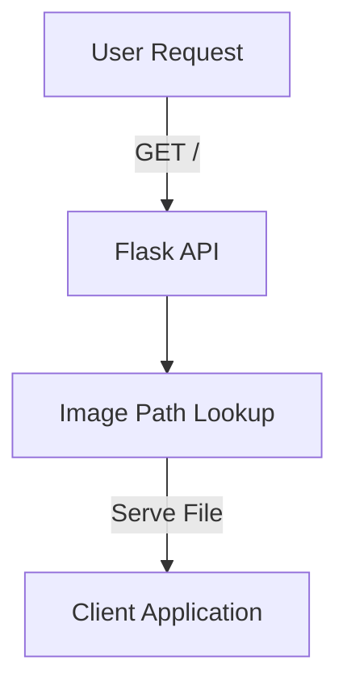

<h1 align="center">🎨 <a href="https://github.com/Gethsemane-Baptist-Church-Longbeach/God-is-Wallpaper-API">God-is Wallpaper API</a></h1>

<h4 align="center">📱 A Flask-based API for delivering monthly wallpapers and thumbnails designed for various devices.</h4>

<p align="center">
  <a href="https://twitter.com/PinoyITSolution"></a>
  <a href="https://github.com/ronknight?tab=followers"></a>
  <a href="https://github.com/ronknight/ronknight/stargazers"></a>
  <a href="https://github.com/ronknight/ronknight/network/members"></a>
  <a href="https://youtube.com/@PinoyITSolution"></a>
  <a href="https://github.com/Gethsemane-Baptist-Church-Longbeach/God-is-Wallpaper-API/issues"></a>
  <a href="https://github.com/Gethsemane-Baptist-Church-Longbeach/God-is-Wallpaper-API/blob/master/LICENSE"></a>
  <a href="https://github.com/ronknight"></a>
</p>

<p align="center">
  <a href="#project-overview">Project Overview</a> •
  <a href="#features">Features</a> •
  <a href="#installation">Installation</a> •
  <a href="#usage">Usage</a> •
  <a href="#visualization">Visualization</a> •
  <a href="#contributing">Contributing</a> •
  <a href="#license">License</a> •
  <a href="#disclaimer">Disclaimer</a>
</p>

---

## 📖 Project Overview
The **GodIs Wallpaper API** is a Flask-powered RESTful API that provides inspirational wallpapers and thumbnails for various devices, categorized by month. This API is designed to serve high-quality visual content suitable for laptops, phones, tablets, and watches.

---

## ✨ Features
- **Dynamic Content Delivery**: Fetch wallpapers and thumbnails tailored for specific devices.
- **Monthly Themes**: Wallpapers categorized by months for better organization.
- **Randomization**: Get a random wallpaper or thumbnail with a single request.
- **Optimized File Serving**: Ensures quick delivery of image assets.

---

## 🛠️ Installation

1. **Clone the Repository**:
   ```bash
   git clone https://github.com/Gethsemane-Baptist-Church-Longbeach/God-is-Wallpaper-API.git
   ```
2. **Navigate to the Project Directory**:
   ```bash
   cd GodIs-WallpaperAPI
   ```
3. **Install Dependencies**:
   ```bash
   pip install -r requirements.txt
   ```
4. **Set Up Directory Structure**:
   - Ensure the `static/wallpapers` and `static/thumbnails` directories contain organized subdirectories by month (e.g., `January`, `February`, etc.).
   - Place device-specific images (`laptop.jpg`, `phone.png`, etc.) inside each month’s folder.

5. **Run the Server**:
   ```bash
   python app.py
   ```
6. **Access the API**:
   Open your browser and navigate to `http://127.0.0.1:5000`.

---

## 🚀 Usage

### Endpoints

#### Retrieve All Months
```bash
GET /months
```
**Response**:
```json
["January", "February", "March", ...]
```

#### Retrieve a Specific Wallpaper
```bash
GET /<month>/<device>
```
**Example**:
```bash
GET /January/laptop
```

#### Retrieve a Random Wallpaper for a Device
```bash
GET /random-<device>
```
**Example**:
```bash
GET /random-phone
```

#### Retrieve Any Random Wallpaper
```bash
GET /random
```

#### Retrieve a Thumbnail
```bash
GET /thumbnails/<month>/<device>
```
**Example**:
```bash
GET /thumbnails/January/tablet
```

#### Retrieve a Random Thumbnail for a Device
```bash
GET /thumbnails/random-<device>
```
**Example**:
```bash
GET /thumbnails/random-watch
```

#### Retrieve Any Random Thumbnail
```bash
GET /thumbnails/random
```

---

## 📊 Visualization



> **Tip**: If you encounter a Mermaid rendering issue such as **“Could not find a suitable point for the given distance”**, try simplifying your diagram structure, reducing text in nodes, or testing it in an external [Mermaid Live Editor](https://mermaid.live).

---

## 🤝 Contributing
Contributions are welcome! To get started:
1. Fork the repository.
2. Create a feature branch:  
   ```bash
   git checkout -b feature-name
   ```
3. Commit your changes:  
   ```bash
   git commit -m 'Add a feature'
   ```
4. Push to the branch:  
   ```bash
   git push origin feature-name
   ```
5. Open a Pull Request.

---

## 📝 License
This project is licensed under the **MIT License**. See the [LICENSE](https://github.com/Gethsemane-Baptist-Church-Longbeach/God-is-Wallpaper-API/blob/master/LICENSE) file for details.

---

## ⚠️ Disclaimer
This project provides access to copyrighted resources. Ensure proper attribution and usage comply with applicable licensing agreements.
